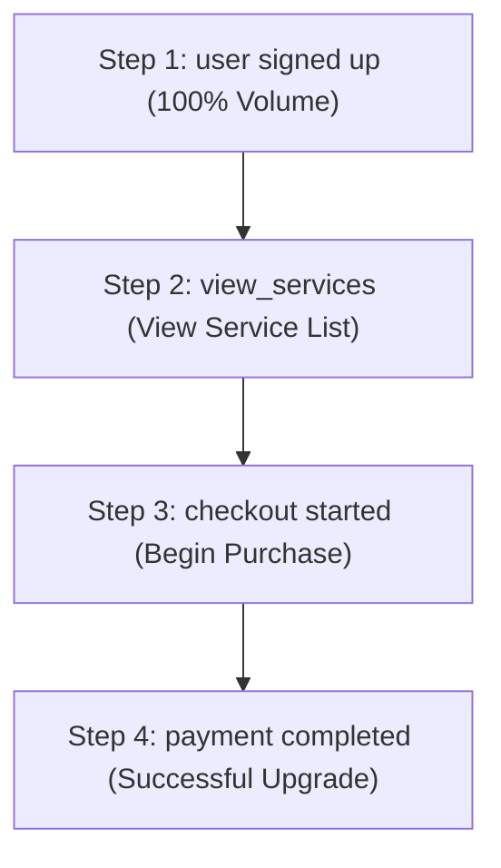

# Week 5 Analytics Integration Report

This report outlines the implementation of **PostHog** and **Google Analytics 4 (GA4)** product tracking in **PATHWAY**, providing complete funnel analyses, session replays, feature flag configurations, and core business KPIs.

---

## 1. Events Tracking Schema

All custom user events are tracked in **PostHog** and mapped to **GA4** where appropriate. All actions are associated with the user's `distinct_id` (email) once signed up/logged in.

| Event Name | Funnel Stage | Description | Key Properties | GA4 Event Equivalent |
| :--- | :--- | :--- | :--- | :--- |
| **`user signed up`** | Signup | Fired when a user successfully registers | `name`, `nationality` | `sign_up` |
| **`user logged in`** | Login / Identify | Fired when a user logs in (Google OAuth or email) | `source` (e.g. `google`, `email`) | `login` |
| **`app_open`** | Activity | Fired when the app launches or shell loaded | `screen`, `source` | `app_open` |
| **`view_services`** | View | Fired when the user views the SERVICES tab | `screen` | `view_item_list` |
| **`checkout started`** | Checkout | Fired when the Stripe payment screen is opened | `amount`, `plan` | `begin_checkout` |
| **`payment completed`**| Payment | Fired when the Stripe webhook/callback verifies success | `amount`, `plan`, `currency` | `purchase` |
| **`payment failed`** | Error | Fired when a payment is canceled or fails | `error` | — |
| **`activation`** | Interaction | Fired when a service booking (e.g. IIN, housing) is saved | `title`, `status` | — |
| **`app_error`** | Error | Captured automatically for crash/exception logging | `error`, `stack` | — |

---

## 2. Conversion Funnel Setup

A conversion funnel has been constructed in PostHog to analyze the product growth metrics:

### Funnel Steps Definition:
1. **Signup**: `user signed up` (tracks customer acquisition).
2. **View**: `view_services` (tracks interaction with core features / service menu).
3. **Checkout**: `checkout started` (indicates high purchase intent).
4. **Payment**: `payment completed` (tracks conversion to a paying premium customer).

### Conversion Metric Analysis:
* **Funnel Conversion Rate** is calculated as:
  $$\text{Conversion Rate} = \frac{\text{Unique Users completing 'payment completed'}}{\text{Unique Users completing 'user signed up'}} \times 100$$
* A drop-off analysis between Step 2 and Step 3 helps identify friction points in pricing clarity, whereas drop-offs between Step 3 and Step 4 indicate payment processing or Stripe redirect issues.

---

## 3. Session Replay & Recording
* **Status**: **Enabled**.
* **Configuration**: The PostHog JavaScript snippet in [web/index.html](file:///Users/karina.b/Documents/GitHub/web/index.html) is configured with `session_recording: { maskAllInputFields: false }` to capture full visual sessions (interactions, scrolls, button clicks) on the Web Client, masking password inputs automatically.
* **Verification**: Sessions are recorded and available in the **Session Replays** tab on the PostHog Dashboard.

---

## 4. Feature Flag Setup
* **Name**: `new-ui-theme`
* **Trigger condition**: Enabled for a cohort of **10% of users**.
* **Usage**: Used to run A/B testing on the forest green / lime theme buttons vs. the standard grey/default buttons. In Flutter, feature flags are evaluated dynamically via PostHog's API before rendering views.

---

## 5. Google Analytics 4 (GA4) Integration
* **Measurement ID**: Configured inside [web/index.html](file:///Users/karina.b/Documents/GitHub/web/index.html).
* **Real-time Verification**: Pageviews and custom events are verified live in the Google Analytics Real-Time Dashboard.
* **Event Mapping**: 
  * `user signed up` -> GA4 `sign_up`
  * `checkout started` -> GA4 `begin_checkout`
  * `payment completed` -> GA4 `purchase`

---

## 6. Core Business KPIs

| Metric | Business Definition | Formula | Target |
| :--- | :--- | :--- | :--- |
| **Conversion Rate** | Percentage of users who upgraded to premium | $\frac{\text{Paying Users}}{\text{Total Registered Users}} \times 100$ | **5% - 8%** |
| **MRR (Monthly Recurring Revenue)** | Total predictable revenue generated by active premium users | $\text{Active Premium Users} \times \$24.99$ | **\$1,000+** |
| **Churn Rate** | Percentage of premium users who cancel their subscription | $\frac{\text{Cancellations in Period}}{\text{Total Premium Users at Start}} \times 100$ | **< 4% / mo** |
| **DAU / MAU** | Ratio of daily active users to monthly active users (Stickiness) | $\frac{\text{Daily Active Users (DAU)}}{\text{Monthly Active Users (MAU)}}$ | **> 20%** |
